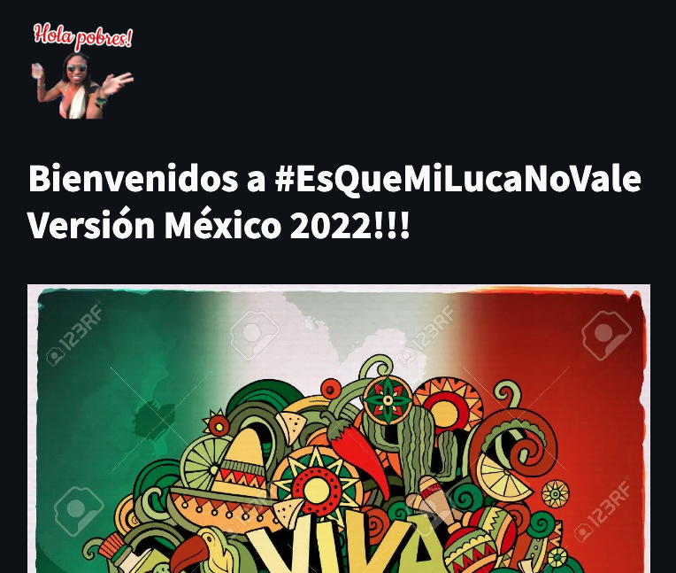

# mexico_2022: Es que mi luca no vale - my money is worthless

This is an app built just for fun.

5 friends in a trip in Mexico using different currencies (USD, EUR, COP) needing to convert the amounts in MXN to their own currencies, and also needing to correctly divide and define who's gonna pay the tips. This was a mess, so laughs are coming and the app is here to start them.

You can access the app [here](https://share.streamlit.io/econdavidzh/mexico_2022/main/esquemilucanovale.py)

